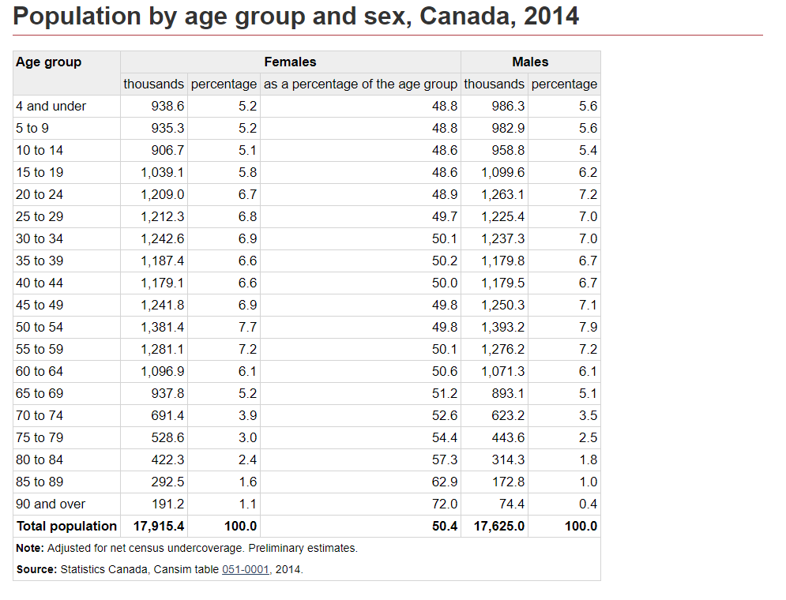
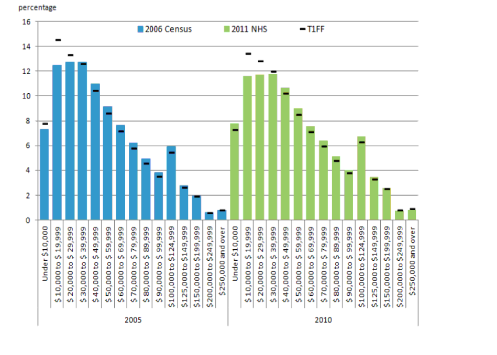

```{r setup, include=FALSE}
knitr::opts_chunk$set(echo = FALSE)
library(dplyr)
library(knitr)
library(ggplot2)
library(tidyverse)
library(scales)
library(kableExtra)
```

## Abstract

## Introduction

## Data
This analysis uses the data collected by the 2017 General Social Survey (GSS). A survey done by the Social and Aboriginal Statistics Division of Statistics Canada. Their focus for that year of data collection was Family and the different forms family takes across Canada. This involved collecting data on current living arrangements, child care, household chores splits and many more. However, for the purpose of this analysis the key pieces of collected data are whether or not a female respondent has had children, what her reported education level is, how religious they are, how old they are, what their current family income is, and whether they live in a rural or urban community. Table 1 displays the first couple responses along the variables of interest.

### Table 1
```{r, tidy =FALSE, echo =FALSE, warning= FALSE}
my_data <- read.csv("gss-prepared-for-analysis.csv") #read in the data 

display_data <- my_data %>% #Select variables of interest 
  select(
    caseid,
    sex,
    child,
    age,
    income_family,
    education_level,
    pop_center
  )

#Shorten the response descriptions
display_data[display_data=="Larger urban population centres (CMA/CA)"] <- "Urban"
display_data[display_data=="Rural areas and small population centres (non CMA/CA)"] <- "Rural"
display_data[display_data=="$25,000 to $49,999"] <- "25k to 50k"
display_data[display_data=="Less than $25,000"] <- "25k or less"
display_data[display_data=="$50,000 to $74,999"] <- "50k to 75k"
display_data[display_data=="$75,000 to $99,999"] <- "75k to 100k"
display_data[display_data=="$100,000 to $ 124,999"] <- "100k to 125k"
display_data[display_data=="$125,000 and more"] <- "125k or more"


# Table 1 of the first couple responses 

Table1 <- head(display_data) %>% 
  kable(align = "c",
        format = "simple",
        col.names = c("Case ID", "Sex", "Have Children", "Age", 
                      "Family Income", "Education Level", "Urban / Rural"),
        ) %>% 
  kable_styling(font_size = 5)
  
Table1
```

The data for the GSS was collected from Feb. 2nd, 2017 to Nov. 30th, 2017. The target population of this survey was all non-institutionalized people living in Canada's 10 provinces and who are 15 years or older (GSS 2017). This notably immediately excludes those who have been imprisoned or are in hospitals or nursing homes. It also excludes those who live in the Canadian territories. Both are notable exclusions as they may have very different experiences as compared to the average respondent. Specifically many of Canada’s First Nation and Inuit reserves are in the territories.

The Survey is further reduced by it’s chosen frame. It uses a combination of telephone numbers (landline and cellular) with Stats Canada’s Address Register (GSS 2017). Which removes the possibility of those who do not own phones, or do not have a stable address from those that could be sampled. This is also important as it removes individuals who may be experiencing acute poverty as well as those who have recently moved. It is notable even those with stable housing may not be included if they do not have a phone number. 

This frame is then sampled via cross sectional design, where geographical regions were split into strata. Each strata was then randomly sampled without replacement. Households were then called when they then had to confirm if an individual above the age of 15 lived there. Once that was confirmed a random member of the household over 15 was selected and interviewed over the phone (GSS 2017). This requirement for voluntary agreement to partake in a long form telephone interview does provide some sampling bias. 

This will affect all of our data in the same manner. While we will be working with a subset of the data, only looking at female respondents, these women living in Canada will have had to have an address, phone number, live in the provinces, and be willing to voluntarily take a phone survey. 

Something of note in the data collection is that income was collected by connecting households to their household tax returns. This means that much of the ambiguity often present in self reported income survey responses was removed from the data. This is hugely useful for better studying low and high income individuals as they have commonly been known to over or under report their earnings. 

For further information the User Guide and Raw Codebook of the GSS has been included in the "Data Information" file in this projects related Github. 

Now to dig deeper into the data. Based on the number of respondents able to be used in this analysis, 10,916, and the overall female population of Canada 17.8 million, the analysis should have a general confidence level of 95% (Survey Systems 2020). However, to check against obvious sampling errors let’s review the ages of respondents, their incomes, and their education levels.

Figure 1 displays the general breakdown of respondents ages. This is followed by a table taken from Anne Milan’s report on the age of the Female population in Canada (Milan 2016). As can be seen the sampling method caused an over representation of older individuals and an under representation of the young. This could have to do with the requirement of a stable address, or because of the voluntary nature of the survey. 

### Figure 1
```{r, tidy =FALSE, echo =FALSE, warning= FALSE}
Figure1 <- my_data %>% #Create an overall view of Age of respondents 
  ggplot(aes(x = age_group)) +
  geom_bar(aes(y = ..prop..), stat = "count", fill = "steelblue") + 
  scale_y_continuous(labels=scales::percent) +
  labs(title = "Respondants by Age Group", y = "Percentage Frequencies", x = "Age Group")+
  theme_minimal()  #Adjust how it is displayed 
  
Figure1 
```

### Figure 1.B Canadian Female Population by Age 2014

(Milan 2016)

Figure 2 displays the general breakdown of respondents by Family/Household income. When comparing this to a table provided by the 2010 National Household Survey, despite the difference in bin definition, we see that there are highly skewed results towards those with higher incomes (Stats Canada 2018). Both data sets used non-institutionalized Canadians aged 15 and older, who lived together in a household.  Again this could be both from the fact that addresses were required meaning those living more transiently were not tracked properly, and individuals had to be willing to provide a large amount of their time voluntarily. Something that could be more difficult for someone making a lower income. 

### Figure 2
```{r, tidy =FALSE, echo =FALSE, warning= FALSE}
display_data2 <- my_data %>% #select smaller subset fo data 
  select(
    age_group,
    income_family
  )

#Shorten the responses 
display_data2[display_data2=="$25,000 to $49,999"] <- "25k to 50k"
display_data2[display_data2=="Less than $25,000"] <- "25k or less"
display_data2[display_data2=="$50,000 to $74,999"] <- "50k to 75k"
display_data2[display_data2=="$75,000 to $99,999"] <- "75k to 100k"
display_data2[display_data2=="$100,000 to $ 124,999"] <- "100k to 125k"
display_data2[display_data2=="$125,000 and more"] <- "125k or more"


Figure2 <- display_data2 %>% #Create an overall view of family income for the respondents 
    mutate(income_family = fct_relevel(income_family, 
            "25k or less", "25k to 50k", "50k to 75k", 
            "75k to 100k", "100k to 125k", "125k or more")) %>%
  ggplot(aes(x = income_family)) +
  geom_bar(aes(y = (..count..)/sum(..count..)), stat = "count", fill = "steelblue") + 
  scale_y_continuous(labels=scales::percent) + #Make it a percentage based scale
  labs(title = "Respondants by Family/Household Income", y = "Percentage Frequencies", x = "Family/Household Income")+
  theme_minimal()  #Adjust how it is displayed 
  
Figure2 
```

### Figure 2.B Canadian Family Income Levels 2010

(Stats Canada 2018)

What these two modes of analysis show is that the frame of data collection had a significant effect on those that were surveyed. 

However, looking at Figure 3 shows the breakdown by Education Level. When comparing this table to a distribution from the 2016 Census we see that the sample population is similarly distributed to the Canadian population (Stats Canada 2019). While the bins are defined differently, combining the census bins together as well as combining our split of Undergraduate versus Graduate University degrees all percentages are within 10% of each other. 

### Figure 3
```{r, tidy =FALSE, echo =FALSE, warning= FALSE}
Figure3 <- my_data %>% #Create an overall view of education level of respondents 
  mutate(education_level = fct_relevel(education_level, 
            "HS or less", "College / Trade", "University Undergraduate", 
            "University Graduate")) %>%
  ggplot(aes(x = education_level)) +
  geom_bar(aes(y = (..count..)/sum(..count..)), stat = "count", fill = "steelblue") + 
  scale_y_continuous(labels=scales::percent) +
  labs(title = "Respondants by Education Level", y = "Percentage Frequencies", x = "Education Level")+
  theme_minimal()  #Adjust how it is displayed 
  
Figure3 
```

### Figure 3.B Canadian Education Levels by Percentage 2016

(Stats Canada 2019)

Having said all this the average likelihood or probability that a woman would have children in our sample was 0.73. Next we will begin to model this probability to see how it is affected by our independent variables. 


## Model

We are interested in how variables such as age, family income, education level, and population center affect a woman’s decision to have children. Due to the large sample size and the nature of GSS, the sample represents the population well. The model that we are using is logistic regression, it works well for our response variable, which is a categorical variable, and it incorporates both numerical and categorical explanatory variables. 

Logistic regression estimates $\beta_0...\beta_k$ in the following equation:
$$
log(\frac{p}{1-p})=\beta_0+\beta_1x_1+...+\beta_kx_k
$$
In our case, it estimates $\beta_{age},\beta_{inc},\beta_{edu},\beta_{pop}$ in:
$$
log(\frac{p}{1-p})=\beta_0+\beta_{age}x_{age}+\beta_{inc}x_{inc}+\beta_{edu}x_{edu}+\beta_{pop}x_{pop}
$$

We use `glm()` from `stats` package to fir the model to our data. We use `as.factor()` to incorporate dummy variables for all the categorical variables: family income, education level and the type of population center. For each categorical variable with n levels, we need n-1 dummy variables to fully study its influence on our response variable. 

The dummy variables setting ups are stated in table x, y and z.

```{r}
dummy_income <- data.frame(
  "income level" = c("greater than $125,000", "between $25,000 to $49,999", "between $50,000 to $74,999", "between $75,000 to $99,999", "less than $25,000", "between $100,000 tp $124,999"),
  inc1 = c(1,0,0,0,0,0),
  inc2 = c(0,1,0,0,0,0),
  inc3 = c(0,0,1,0,0,0),
  inc4 = c(0,0,0,1,0,0),
  inc5 = c(0,0,0,0,1,0),
  inc6 = c(0,0,0,0,0,0)
)

kable(dummy_income, caption = "Dummy Variable Coding Set Up for Income Levels")
```

```{r}
dummy_edu <- data.frame(
  "education level" = c("high school or less education", "University Graduate", "University Undergraduate", "college/trade"),
  HS = c(1,0,0,0),
  graduate = c(0,1,0,0),
  under = c(0,0,1,0),
  college = c(0,0,0,0)
)

kable(dummy_edu, caption = "Dummy Variable Coding Set Up for Education Levels")
```

```{r}
dummy_pop <- data.frame(
  "population center" = c("Poplation centered at PEI", "Rural areas and small population centres(non CMA/CA)", "Larger urban population centres (CMA/CA)"),
  PEI = c(1,0,0),
  rural = c(0,1,0),
  urban = c(0,0,0)
)

kable(dummy_pop, caption = "Dummy Variable Coding Set Up for Population Center")
```

```{r, include = FALSE}
#logistic regression
my_logit_dd <- glm(
  child ~ age + as.factor(income_family) + as.factor(education_level) 
  + as.factor(pop_center),
  data = my_data, family = "binomial"
)

summary(my_logit_dd)
```

## Results

Table x summaries our model results:

```{r}
my_log_res <- data.frame(
  variable = c("intercept","age", "income greater than $125,000", "income between $25,000 to $49,999", "income between $50,000 to $74,999", "income between $75,000 to $99,999", "income less than $25,000", "high school or less education", "University Graduate", "University Undergraduate","Poplation centered at PEI", "Rural areas and small population centres(non CMA/CA)"),
  estimate = c(-1.513991, 0.060790, 0.161424, -0.680099, -0.449230, -0.197017, -0.872898, -0.102521, -0.779989, -0.468140, 0.276375, 0.526007),
  pvalue = c("< 2e-16", "< 2e-16", "0.0810", "8.24e-13", "3.49e-06", "0.0491", "< 2e-16", "0.0982", "< 2e-16", "9.25e-13", "0.0409", "2.86e-14" )
)

kable(my_log_res, caption = "Summary of Losgistic Estimates", 
      label = "Data Source: GSS2017")
```

In an equation, this means 
$$
log(\frac{\hat{p}}{1-\hat{p}})=\hat{\beta_0}+\hat{\beta}_{age}x_{age}+\hat{\beta}_{inc_1}x_{inc_1}+\hat{\beta}_{inc_2}x_{inc_2}+\hat{\beta}_{inc_3}x_{inc_3}
$$

$$
+\hat{\beta}_{inc_4}x_{inc_4}+\hat{\beta}_{inc_5}x_{inc_5}+\hat{\beta}_{HS}x_{HS}+\hat{\beta}_{graduate}x_{graduate}+\hat{\beta}_{under}x_{under}
$$

$$
+\hat{\beta}_{PEI}x_{PEI}+\hat{\beta}_{rural}x_{rural} 
$$

Notice that we have incorporated our categorical variables using dummy variables. “inc1”, “inc2”, “inc3”, “inc4”, “inc5” represent the six income categories; "HS”,  "graduate" and "under" describe the four education levels; "PEI" and "rural" represent the three population center. 

The model predicts the following result for the probability a woman has children p, rounded to three decimal places. Since log is an one to one function with p, we say the change on $log(\frac{\hat{p}}{1-\hat{p}})$ is isomorphic to any change on p, the probalbility that a woman in Canada has children. 

$$
log(\frac{\hat{p}}{1-\hat{p}})= -1.51 +0.061x_{age}+0.161x_{inc_1}-0.68x_{inc_2}-0.449x_{inc_3}
$$

$$
-0.197x_{inc_4}-0.873x_{inc_5}-0.103x_{HS}-0.78x_{graduate}-0.468x_{under}
$$

$$
+0.276x_{PEI}+0.526x_{rural} 
$$

The interpretation of the dummy variables’ prediction results is comparing it to a certain level that is not in the equation above. A $\hat{\beta}_{HS} = -0.103$ does not mean the coefficient for a high school level education is -0.103. It represents the difference of influence (on childbirth decision) between a woman who has a college level of education and a high school level of education. -0.103  indicates that a woman who has a high school degree or below is less likely to have children than a woman who has a college degree if it is influential at all depending on the p-value.

Using $\alpha = 0.05, H_0: \hat{\beta} = 0, \hat{\beta} \neq0$, 
the p values indicate weak evidence that having a family income higher than 125,000 dollars/year affects a woman's probability of having children. At the same time, it is evident that other income levels do influence the probability. A p-value of 0.0982 > 0.05 indicates weak evidence to reject $H_0$; therefore, we cannot say having high school or fewer education influences a woman's probability of having children.

There is evidence that both having a family income between 75,000 to 99,999 dollars per year and living in an area with a population center at PEI have influences on p because their p values are smaller but close to 0.05. There is strong evidence that the rest of the variables influences p.

All else the same, an older woman is more likely to have children than a young woman. A woman's family income affects her decision to have children when the income is below 125,000 dollars per year. Having a university graduate or undergraduate degree reduces a woman's probability of having children comparing to having a college degree while having high school or less education does not affect that decision. A woman living in PEI or rural areas and smaller population centers are more likely to have children than a woman living in urban areas and larger population centers.

```{r, include = FALSE}
summary(my_logit_dd)
```

## Discussion


## References
- Monica Alexander (2019). “Analyzing Name Changes after Marriage Using a Non-Representative Survey.” Monica Alexander, 7 Sept. 2019, www.monicaalexander.com/posts/2019-08-07-mrp/.
- Rohan Alexander and Sam Caetano (2020). "GSS_Cleaning" Retreived from https://q.utoronto.ca/courses/184062
- JJ Allaire and Yihui Xie and Jonathan McPherson and Javier Luraschi and Kevin Ushey and Aron Atkins and Hadley Wickham and Joe Cheng
and Winston Chang and Richard Iannone (2020). rmarkdown: Dynamic Documents for R. R package version 2.3. URL
https://rmarkdown.rstudio.com.
- Sam Firke (2020). janitor: Simple Tools for Examining and Cleaning Dirty Data. R package version 2.0.1.
https://CRAN.R-project.org/package=janitor
- GSS. (2017). General Social Survey – Family (GSS). Retrieved from https://www.statcan.gc.ca/eng/survey/household/4501
- Lauren Kennedy, and Jonah Gabry (2020). “MRP with Rstanarm.” Rstanarm, mc-stan.org/rstanarm/articles/mrp.html.
- Anne Milan (2016). “Female Population.” Government of Canada, Statistics Canada, www150.statcan.gc.ca/n1/pub/89-503-x/2015001/article/14152-eng.htm.
- Statistics Canada (2018). “Income Reference Guide, National Household Survey, 2011.” Government of Canada, Statistics Canada, www12.statcan.gc.ca/nhs-enm/2011/ref/guides/99-014-x/99-014-x2011006-eng.cfm.
- Statistics Canada (2019). “2016 Census.” Highest Level of Educational Attainment (General) by Selected Age Groups 25 to 64, Both Sexes, % Distribution 2016, Canada, Provinces and Territories, 2016 Census – 25% Sample Data, www12.statcan.gc.ca/census-recensement/2016/dp-pd/hlt-fst/edu-sco/Table.cfm?Lang=E&T=11&Geo=00&SP=1&view=2&age=2&sex=1
- Survey Systems (2020). “Sample Size Calculator.” Sample Size Calculator - Confidence Level, Confidence Interval, Sample Size, Population Size, Relevant Population - Creative Research Systems, 2020, www.surveysystem.com/sscalc.htm.
- Yihui Xie (2020). knitr: A General-Purpose Package for Dynamic Report Generation in R. R package version 1.29.
- Yihui Xie (2015) Dynamic Documents with R and knitr. 2nd edition. Chapman and Hall/CRC. ISBN 978-1498716963
- Yihui Xie (2014) knitr: A Comprehensive Tool for Reproducible Research in R. In Victoria Stodden, Friedrich Leisch and Roger D.
Peng, editors, Implementing Reproducible Computational Research. Chapman and Hall/CRC. ISBN 978-1466561595
- Yihui Xie and J.J. Allaire and Garrett Grolemund (2018). R Markdown: The Definitive Guide. Chapman and Hall/CRC. ISBN 9781138359338.
URL https://bookdown.org/yihui/rmarkdown.
- Hadley Wickham, Romain François, Lionel Henry and Kirill Müller (2020). dplyr: A Grammar of Data Manipulation. R package version
1.0.2. https://CRAN.R-project.org/package=dplyr
- Wickham et al., (2019). Welcome to the tidyverse. Journal of Open Source Software, 4(43), 1686, https://doi.org/10.21105/joss.01686
- Hadley Wickham and Dana Seidel (2020). scales: Scale Functions for Visualization. R package version 1.1.1.
https://CRAN.R-project.org/package=scales
- H. Wickham. ggplot2: Elegant Graphics for Data Analysis. Springer-Verlag New York, 2016.
- Hao Zhu (2020). kableExtra: Construct Complex Table with 'kable' and Pipe Syntax. R package version 1.2.1.
https://CRAN.R-project.org/package=kableExtra

